# Medical Records Smart Contracts

A comprehensive blockchain-based solution for managing medical records with patient-controlled access permissions, secure document storage, and immutable audit trails.

## Overview

This project implements three interconnected smart contracts that enable:

1. **Patient-controlled access management** - Patients can grant and revoke access to their medical records
2. **Secure medical document storage** - Doctors can create and manage medical documents with proper permissions
3. **Comprehensive audit logging** - All system activities are logged immutably for compliance and transparency

## Smart Contracts

### 1. AccessControl Contract (`contracts/AccessControl.sol`)

**Purpose**: Manages permissions for accessing medical records

**Key Features**:
- Patient registration and entity type management
- Grant/revoke access with different permission levels (READ, WRITE, FULL)
- Time-based access expiration
- Permission hierarchy validation
- Multi-entity access management

**Main Functions**:
- `registerPatient()` - Register as a patient
- `registerEntity(address, EntityType)` - Register doctors, insurance companies, or auditors
- `grantAccess(address, AccessType, expiresAt, purpose)` - Grant access to an entity
- `revokeAccess(address)` - Revoke access from an entity
- `checkPermission(patient, entity, accessType)` - Verify if an entity has specific access

### 2. MedicalRecords Contract (`contracts/MedicalRecords.sol`)

**Purpose**: Manages medical document metadata and ownership

**Key Features**:
- Document creation with IPFS hash storage
- Metadata management (type, description, tags)
- Document ownership validation
- Integration with AccessControl for permission checks
- Document lifecycle management (create, update, deactivate)

**Main Functions**:
- `addDocument(patient, ipfsHash, documentType, description, tags)` - Create new medical document
- `getDocument(documentId)` - Retrieve document details
- `updateDocumentMetadata(documentId, description, tags)` - Update document metadata
- `getPatientDocuments(patient)` - Get all documents for a patient
- `deactivateDocument(documentId)` - Soft delete a document

### 3. AuditTrail Contract (`contracts/AuditTrail.sol`)

**Purpose**: Provides immutable audit logging for compliance

**Key Features**:
- Comprehensive activity logging
- Integrity verification with data hashes
- Compliance reporting and analytics
- Suspicious activity detection
- Audit trail querying by various criteria

**Main Functions**:
- `logAccess(patient, accessor, documentId, accessType, purpose)` - Log document access
- `logPermissionChange(patient, entity, action, accessType, expiresAt)` - Log permission changes
- `logDocumentOperation(actor, patient, documentId, action, details)` - Log document operations
- `getAuditTrail(entity, fromIndex, limit)` - Get audit history for an entity
- `getPatientAuditTrail(patient, fromIndex, limit)` - Get audit history for a patient

## Architecture


## Document Management Flow

El siguiente diagrama ilustra el flujo completo del sistema de administración de documentos y permisos:

```mermaid
flowchart TD
    %% Level 1
    P[👤 Patient Holder] --> D[📄 Document Admin]
    P --> AP[⚙️ Permission Admin]

    %% Level 2 - CRUD operations on documents
    D --> C[➕ Create]
    D --> M[✏️ Modify]
    D --> R[📖 Read]

    %% Connection from permission administration to CRUD
    AP --> C
    AP --> M
    AP --> R

    %% Level 3 - Permission options
    AP --> DEL[🗑️ Delete]
    AP --> SD[📂 Specific Document]
    AP --> H[📜 Patient History]

    %% Sector filtering
    DEL --> FS[🏢 Sector Filtering]
    SD --> FS
    H --> FS

    %% Level 4 - Entities
    EA[🏛️ Entity Type A] --> FS
    FS --> V[✅ Valid if Sector A ∈ Entity A]
    EB[🏛️ Entity Type B] --> FS
```


### Descripción del Flujo

1. **Titular (Patient)**: El paciente es el propietario de los registros médicos y puede iniciar la creación de documentos.

2. **Administración de Documentos**: Controla todas las operaciones relacionadas con documentos:
   - **Crearlos**: Crear nuevos documentos médicos
   - **Modificar**: Actualizar documentos existentes
   - **Leer**: Acceder y visualizar documentos
   - **Eliminar**: Eliminar documentos (operación crítica)

3. **Administración de Permisos**: Gestiona el acceso a los documentos:
   - Controla quién puede realizar cada operación
   - Valida permisos antes de permitir acceso
   - Maneja diferentes niveles de acceso

4. **Acceso a Información**:
   - **Documento Específico**: Acceso a un documento particular
   - **Historial del Titular**: Acceso al historial completo del paciente

5. **Filtrado por Sector**: Organiza la información por sectores médicos (cardiología, neurología, etc.)

6. **Tipos de Entidad**:
   - **Entidad Tipo A**: Doctores, especialistas médicos
   - **Entidad Tipo B**: Compañías de seguros, auditores

7. **Validación**: Verifica que el sector del documento pertenezca al tipo de entidad que solicita acceso.

### Integración con Smart Contracts

Este flujo se implementa a través de los tres contratos principales:

- **AccessControl**: Maneja la "Administración de Permisos" y la validación de entidades
- **MedicalRecords**: Gestiona la "Administración de Documentos" y el almacenamiento
- **AuditTrail**: Registra todas las actividades del flujo para auditoría

## Entity Types

- **PATIENT**: Owns medical records, controls access permissions
- **DOCTOR**: Creates and updates medical documents (with permission)
- **INSURANCE**: Processes claims, reviews medical records (with permission)
- **AUDITOR**: Reviews system activity, generates compliance reports

## Access Types

- **READ**: View medical documents and metadata
- **WRITE**: Create and update medical documents (includes READ)
- **FULL**: Complete access including document deletion (includes WRITE and READ)

## Usage Examples

### 1. Patient Grants Access to Doctor

```solidity
// Patient registers
accessControl.registerPatient();

// Doctor gets registered by admin
accessControl.registerEntity(doctorAddress, AccessControl.EntityType.DOCTOR);

// Patient grants read access to doctor for consultation
accessControl.grantAccess(
    doctorAddress,
    AccessControl.AccessType.READ,
    block.timestamp + 86400, // 24 hours
    "Regular checkup consultation"
);
```

### 2. Doctor Creates Medical Document

```solidity
// Doctor creates a new document for patient (needs WRITE access)
uint256 documentId = medicalRecords.addDocument(
    patientAddress,
    "QmXYZ123...", // IPFS hash
    "Lab Result",
    "Blood test results for annual checkup",
    ["blood-test", "annual-checkup", "lab-result"]
);
```

### 3. Insurance Reviews Medical Records

```solidity
// Patient grants access to insurance company
accessControl.grantAccess(
    insuranceAddress,
    AccessControl.AccessType.READ,
    block.timestamp + 604800, // 7 days
    "Insurance claim processing"
);

// Insurance retrieves patient documents
uint256[] memory documentIds = medicalRecords.getPatientDocuments(patientAddress);
```

### 4. Auditor Reviews System Activity

```solidity
// Get audit trail for a specific patient
uint256[] memory auditEntries = auditTrail.getPatientAuditTrail(
    patientAddress,
    0, // from index
    50 // limit
);

// Get daily activity count for compliance
uint256 today = block.timestamp / 86400;
uint256 activityCount = auditTrail.getDailyActivityCount(today);
```

## Security Features

### Access Control
- **Permission-based access**: All operations require proper permissions
- **Time-based expiration**: Access can be granted with automatic expiration
- **Granular permissions**: Different access levels for different use cases
- **Immediate revocation**: Patients can revoke access at any time

### Data Integrity
- **Immutable audit logs**: All activities are permanently recorded
- **Hash verification**: Audit entries include data hashes for integrity verification
- **Suspicious activity detection**: Automated alerts for unusual access patterns

### Privacy Protection
- **Off-chain storage**: Medical documents stored on IPFS, only hashes on-chain
- **Encryption**: Documents should be encrypted before IPFS storage
- **Minimal metadata**: Only necessary metadata stored on-chain

## Testing

The project includes comprehensive test contracts:

- `test/AccessControlTest.sol` - Tests for permission management
- `test/MedicalRecordsTest.sol` - Tests for document management
- `test/AuditTrailTest.sol` - Tests for audit logging

### Running Tests

```bash
# Using Hardhat
npx hardhat test

# Using Truffle
truffle test

# Using Foundry
forge test
```

## Deployment

### Prerequisites

1. Install dependencies:
   ```bash
   npm install
   ```

2. Set up environment variables:
   ```bash
   cp .env.example .env
   # Edit .env with your configuration
   ```

### Deployment Steps

1. **Deploy AccessControl first**:
   ```solidity
   AccessControl accessControl = new AccessControl();
   ```

2. **Deploy MedicalRecords with AccessControl address**:
   ```solidity
   MedicalRecords medicalRecords = new MedicalRecords(address(accessControl));
   ```

3. **Deploy AuditTrail with AccessControl address**:
   ```solidity
   AuditTrail auditTrail = new AuditTrail(address(accessControl));
   ```

4. **Set MedicalRecords address in AuditTrail**:
   ```solidity
   auditTrail.setMedicalRecordsContract(address(medicalRecords));
   ```

## Integration with IPFS

For complete functionality, integrate with IPFS for document storage:

1. **Document Upload Process**:
   - Encrypt document client-side
   - Upload to IPFS
   - Store IPFS hash in smart contract

2. **Document Retrieval Process**:
   - Get IPFS hash from smart contract
   - Retrieve document from IPFS
   - Decrypt document client-side

## Compliance Features

### HIPAA Compliance Considerations
- **Access logging**: All access attempts are logged
- **Audit trails**: Comprehensive activity tracking
- **Access controls**: Patient-controlled granular permissions
- **Data minimization**: Only metadata stored on-chain

### GDPR Compliance Features
- **Right to access**: Patients can view all access logs
- **Right to rectification**: Document metadata can be updated
- **Right to erasure**: Documents can be deactivated
- **Data portability**: All patient data is exportable

## Gas Optimization

The contracts are optimized for gas efficiency:
- **Packed structs**: Efficient storage layout
- **Batch operations**: Multiple operations in single transaction
- **Event-based indexing**: Efficient data retrieval
- **Storage optimization**: Minimal on-chain data storage

## Contributing

1. Fork the repository
2. Create a feature branch
3. Write comprehensive tests
4. Follow Solidity best practices
5. Submit a pull request

## License

This project is licensed under the MIT License - see the [LICENSE](LICENSE) file for details.

## Support

For questions or support, please open an issue on GitHub or contact the development team.

## Roadmap

- [ ] Integration with decentralized identity solutions
- [ ] Multi-signature support for sensitive operations
- [ ] Cross-chain compatibility
- [ ] Advanced analytics and reporting
- [ ] Mobile SDK development
- [ ] Healthcare provider integration APIs


